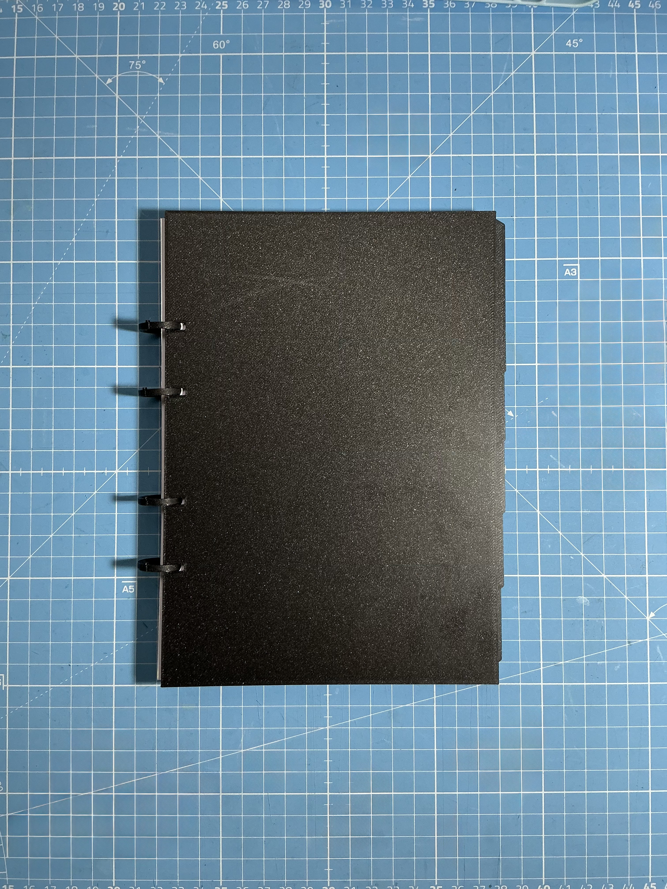
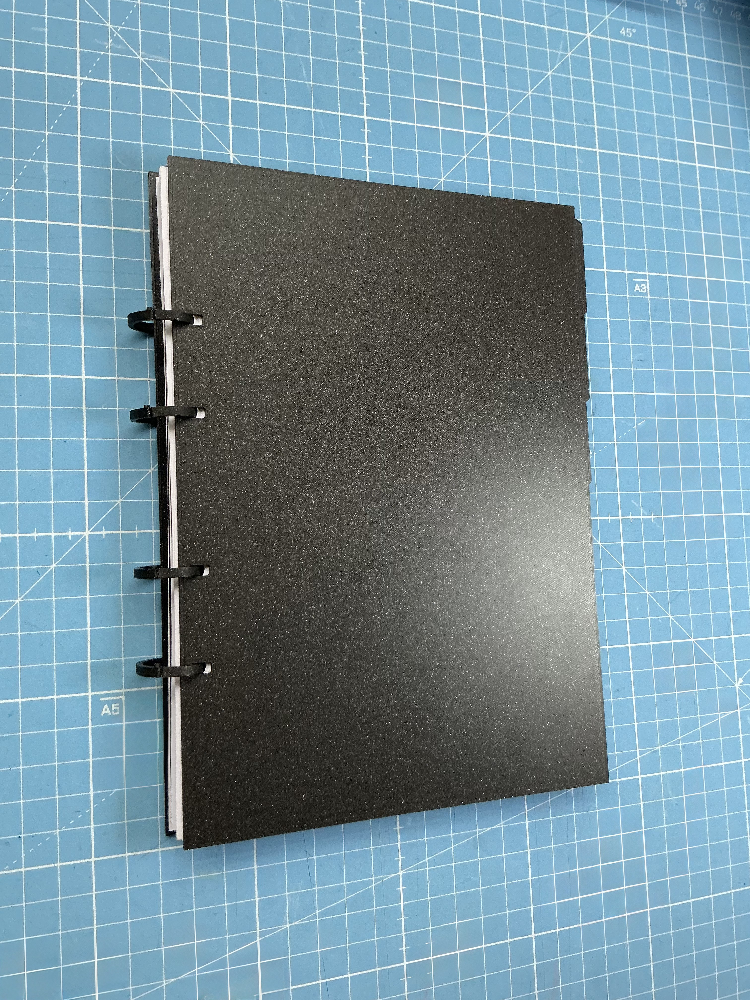
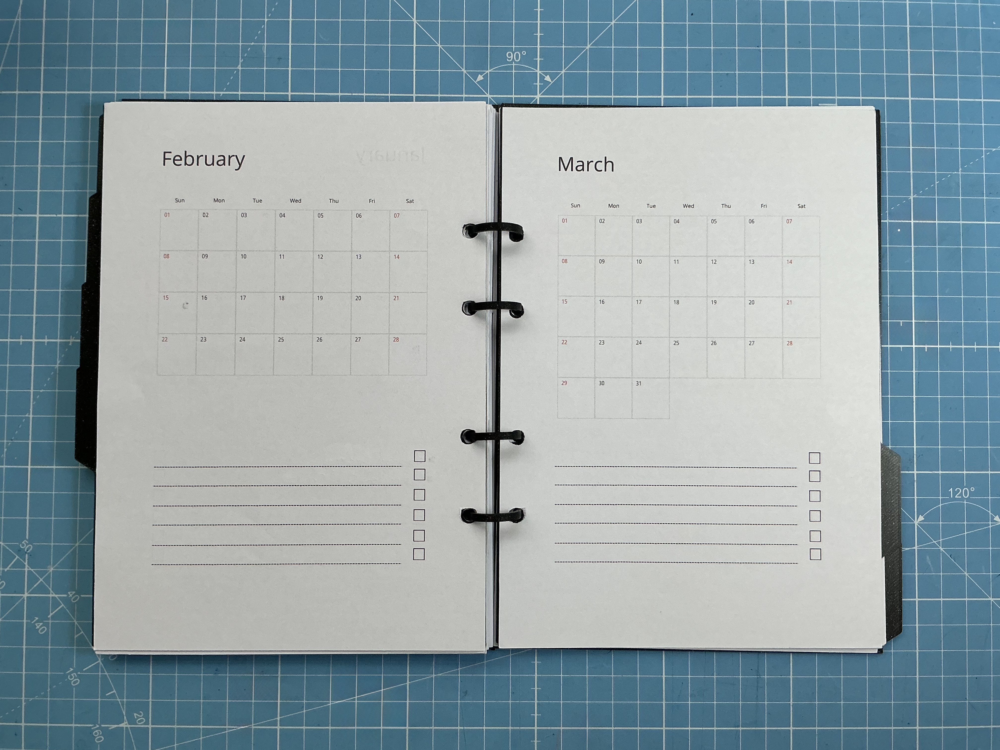
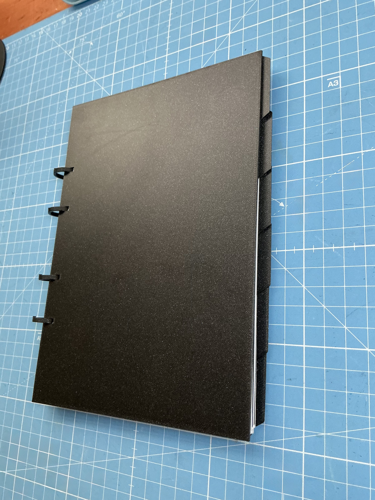

# YAFOSAN  
**Yet Another Fully Open Source A5 Notebook**

YAFOSAN is a minimalist, fully 3D-printable **refillable A5 notebook** with no pretensions.  
The notebook is designed to be compatible with a **standard two-hole punch** and uses rings to secure the paper.

---

## What’s included (files)

This repository includes printable files for:

- Cover
- Binder rings
- Page dividers
- Spacer for punch alignment
- Guide for punching holes in the correct position

All objects are provided in the following formats:
- `.3mf`
- `.step`
- `.FCStd` (FreeCAD source files)

## Build Guide

### General recommendations
- Material: PLA Layer height: 0.2 mm
- No supports required
- Standard A5 paper

---

### Required parts
- Cover ×2
- Binder rings ×4
- Dividers (optional, max 6)
- Punch alignment spacer ×1
- Punching guide ruler ×1

---

### Step-by-step guide

1. Carefully attach the rings to **one** of the covers. This cover will be the **back** of the notebook. The rings have an orientation: the stopper should face the **top** of the notebook. Set this assembly aside for now.
2. Attach the punch alignment spacer to the **two-hole punch**, on the side where the paper is aligned before punching. Double-sided tape is recommended so the spacer can be removed later.
3. Take a sheet of paper and fold it in half. 
4. Mark the exact position where the crease forms after folding.
5. Using the punching guide ruler and its two notches, make the alignment marks for the two-hole punch.
6. Punch the paper.
7. Carefully bend the rings open and insert the punched paper.
8. Insert the second cover (this will be the **front** cover). The paper should now be securely held in place.

## Attribution

YAFOSAN is shared in the spirit of open source and making.
If this project is useful to you, a shout-out or link back to the original repo is appreciated, but never required.

---

## License

This project is licensed under the **MIT License**.
See the [LICENSE.md](LICENSE.md) file for details.
